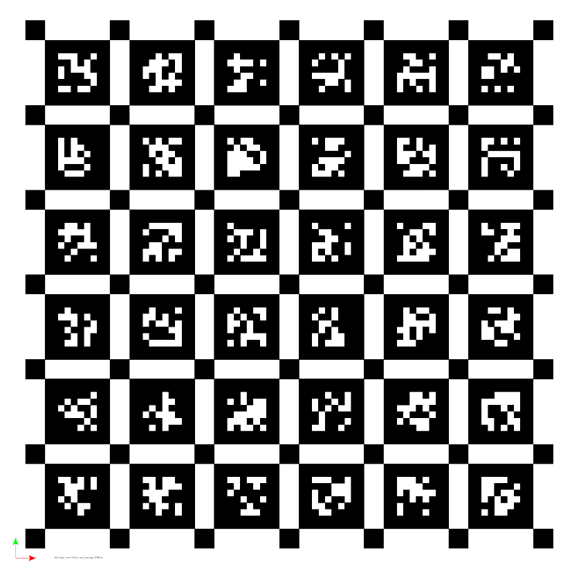
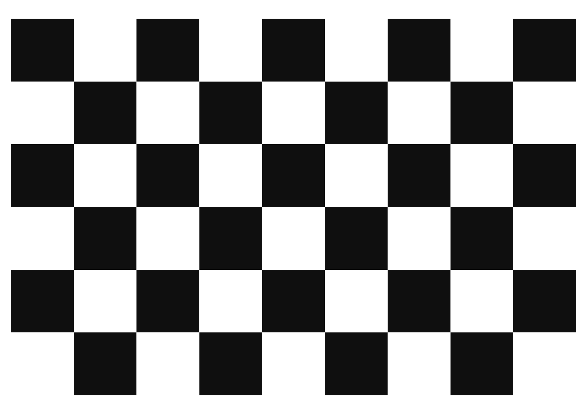

# MA-VIED: A Multisensor Automotive Visual Inertial Event Dataset

MA-VIED is a real-world extensive set of data to support the development of solutions and algorithms for sensor fusion, event-based and frame-based visual tracking, including visual, visual-inertial odometry and SLAM applications. </br>

 <br/>

The MA-VIED Dataset is intended for

- evaluating the performance of vision algorithms in the context of Visual Inertial Odometry (VIO) and Simultaneous Localization and Mapping (SLAM) tasks.
- supporting research endeavors that leverage large-scale driving datasets, especially those equipped with novel neuromorphic vision sensors.

## License

MA-VIED is released under the following License:

Attribution-NonCommercial-ShareAlike 3.0 [CC BY-NC-SA 3.0](LICENSE).

This means it is possible:
* to copy, distribute, display, and perform the work. 
* to make derivative works.

Under the following conditions:</br>
 - Attribution: You must give the original author credit.</br>
 - Non-Commercial — You may not use this work for commercial purposes. </br>
 - Share Alike — If you alter, transform, or build upon this work, you may distribute the resulting work only under a licence identical to this one.

### Privacy Disclaimer 

**Notice:** This automotive dataset is provided as-is and may contain personal information. We take user privacy seriously and have implemented measures to minimize the inclusion of sensitive data. However, given the complexity of real-world data, it is possible that some personal information may be present.

**User Notification and Data Removal:**

Users are encouraged to review the dataset carefully.
If you identify any personal data that should not be included, please promptly raise an issue on our GitHub repository.
We are committed to promptly addressing and resolving privacy concerns.
Upon receiving a valid request, we will make reasonable efforts to remove or anonymize the specified personal data from the dataset.

**Important Considerations:**

The dataset is intended for research and educational purposes.
Users are responsible for complying with privacy and data protection regulations when using this dataset.
We do not assume liability for any unauthorized use of the dataset.

**Contact Information:**

For privacy-related concerns or data removal requests, please contact us at giuseppe.mollica1@studenti.unipg.it

## Citing:
**If you use MA-VIED in an academic work, please cite:**
```
@article{10254473,
  author={Mollica, Giuseppe and Felicioni, Simone and Legittimo, Marco and Meli, Leonardo and Costante, Gabriele and Valigi, Paolo},
  journal={IEEE Transactions on Intelligent Transportation Systems}, 
  title={MA-VIED: A Multisensor Automotive Visual Inertial Event Dataset}, 
  year={2024},
  volume={25},
  number={1},
  pages={214-224},
  keywords={Cameras;Sensors;Wheels;Sensor fusion;Odometry;Standards;Visualization;Visual inertial odometry;event vision;MA-VIED automotive dataset;sensor fusion},
  doi={10.1109/TITS.2023.3312355}
}
```

## 1. The sensor setup

We compiled a dataset using a sensor setup installed on the roof of an electric KIA Soul. Below, we outline the vehicle specifications and the sensor equipment employed. The setup includes Two Wheel Pulse Transducers (WPT) connected to both the left and right wheels of the vehicle. Additionally, the inertial-vision (IV) system comprises an event camera, a standard camera, and an IMU. The in-car sensor data can be accessed through the OBDII interface.

<table>
  <tr>
    <th></th>
    <th></th>
  </tr>
</table> <br/>

<table>
  <tr>
    <th colspan="1">Vehicle Measurements</th>
  </tr>
  <tr>
    	<th rowspan="1" style="align-items: center"> <br/></th>
  </tr>
  <tr>
	<th rowspan="1" style="align-items: center"> <br/></th>
  </tr>
</table>

### 1.1 Sensors, Data Synchronization and Triggering Mechanism

<table>
  <tr>
    <th> </th>
    <th> </th>
  </tr>
 
 <tr>
    <td colspan="2"> <b>Position and Inertial Measurement units (GNSS/INS):</b>  <a href="https://www.movella.com/products/sensor-modules/xsens-mti-g-710-gnss-ins?utm_feeditemid=&utm_device=c&utm_term=xsens%20mti%20g%20710&utm_source=google&utm_medium=ppc&utm_campaign=&hsa_cam=15269931290&hsa_grp=130165872376&hsa_mt=e&hsa_src=g&hsa_ad=561733616084&hsa_acc=1306794700&hsa_net=adwords&hsa_kw=xsens%20mti%20g%20710&hsa_tgt=kwd-1000087376376&hsa_ver=3&utm_feeditemid=&utm_device=c&utm_term=xsens%20mti%20g%20710&utm_source=google&utm_medium=ppc&utm_campaign=ISM+%7C+Europe+%7C+Search&hsa_cam=15269931290&hsa_grp=130165872376&hsa_mt=e&hsa_src=g&hsa_ad=561733616084&hsa_acc=1306794700&hsa_net=adwords&hsa_kw=xsens%20mti%20g%20710&hsa_tgt=kwd-1000087376376&hsa_ver=3&gclid=Cj0KCQjw6KunBhDxARIsAKFUGs9ne0gVkbpUd7k2vujt4ys2TewlIiZ4ZU_GbNMMUpjofL_JDtRdqycaAq-kEALw_wcB">MTi-G-710 GNSS/INS</a>. </td>
 </tr>
 
 <tr>
    <td colspan="2"> <b>Position measurement units (RTK GPS):</b>  <a href="https://store.swiftnav.com/products/piksi-multi-evaluation-kit">Piksi Multi GNSS Module</a> </td>
 </tr>

 <tr>
   <td colspan="2"> <b>Frame Camera Module:</b> <a href="https://www.baslerweb.com/en/products/cameras/area-scan-cameras/dart/daa1920-160um-cs-mount/">daA1920-160um (CS-Mount) - Basler dart</a>. </td>
 </tr>
 
 <tr>
   <td colspan="2"> <b>&nbsp;&nbsp;-> Lens:</b> <a href="https://www.baslerweb.com/en/products/lenses/fixed-focal-lenses/basler-lens-c125-0618-5m-p-f6mm/">Basler Lens C125-0618-5M-P f6mm</a>. </td>
 </tr>
 
 <tr>
   <td colspan="2"> <b>&nbsp;&nbsp;-> Polarizer Filter:</b> <a href="https://schneiderkreuznach.com/en/optical-filters/polarizer-filter">Linear Polarizer Filter</a>. </td>
 </tr>

 <tr>
   <td colspan="2"> <b>Event Camera Module:</b> <a href="https://docs.prophesee.ai/stable/hw/sensors/gen31.html">Prophesee PPS3MVC</a>. </td>
 </tr>
 
 <tr>
   <td colspan="2"> <b>&nbsp;&nbsp;-> Lens:</b> <a href="https://vitalvisiontechnology.com/sv-0813v/">SV-0813V</a>. </td>
 </tr>

 <tr>
    <td colspan="2"> <b>Odometry sensors:</b> <a href="https://www.kistler.com/KR/en/cp/wheel-pulse-transducers-cwpta/P0000859">Kistler WPT sensors </a>. </td>
 </tr>

 <tr>
    <td colspan="2"> <b>Microcontroller Board</b> <a href="https://www.pjrc.com/store/teensy40.html">Teensy® 4.0 Development Board</a>. </td>
 </tr>

<tr>
    <td colspan="2"> <b>Main computer:</b> The system is powered by an Intel Core i7-10710U Processor with integrated Intel Graphics, housed in an  <a href="https://ark.intel.com/content/www/us/en/ark/products/188808/intel-nuc-10-performance-kit-nuc10i7fnk.html"> Intel NUC 10 Performance Kit (NUC10i7FNK) mini PC</a>. To optimize performance and storage capacity, we opted for two distinct storage solutions. The first is a PCI Express x4 NVMe 1.3, 256GB drive dedicated to the operating system (Ubuntu 20.04 LTS 64-bit). The second is a SATA SSD 2.5", 1TB disk allocated for data storage </td>
 </tr>
 
</table>

All sensor data is synchronized using a trigger signal dispatched by a microcontroller, ensuring precise timestamps for accurate temporal alignment.

The microcontroller computes precise millisecond timestamps for each IMU measurement at a frequency of 200Hz. At specific timestamps (28Hz), it initiates various actions:

- Triggers the camera (via the trigger line) to capture a new image.
- Instructs the event camera to record the trigger-in as event data at a rate of 100Hz.
- Commands both RTK receivers (at 28Hz) to log the input trigger.

Timestamps and trigger sequence numbers are available through three distinct ROS topics. Given the varied requirements for alignment, we chose to retain the triggering information, allowing users the flexibility to implement post-processing and alignment procedures as needed.

The 3D CAD model for the roof-mounted setup can be found in the 'additional_material' folder on this project's page.

**Note**: Due to the unavailability of trigger input, the CAN and wheel pulse transducer data are not hardware synchronized with other sensors.

**Note**: Prophesee EVKs and sensors support external triggering (input or output signals), enabling control of the sensor and data synchronization across multiple devices. For details on the event camera triggering mechanism, please refer to the <a href="https://docs.prophesee.ai/stable/hw/manuals/timing_interfaces.html#trigger-in-and-external-trigger-events">Prophesee documentation</a>.

## 2. Data collection campaign
MA-VIED was collected using a Kia Soul electric vehicle equipped with diverse heterogeneous sensors, capturing crucial information for vehicle localization and tracking. The dataset comprises sequences recorded during 13 experimental sessions in varied driving environments (highway, country road, city, racetrack-like) and styles (smooth and rapid maneuvers). These sessions took place in December 2021, as the electric vehicle navigated for several kilometers through different streets in Passignano sul Trasimeno (PG, Umbria, Italy).

 <br/>

The accompanying table illustrates the percentage of RTK fixed data in relation to the total GPS data for both RTK antennas.

|      Sequence name      |  Length(m)  |   Duration(sec)   | Avg. vel. (km/h) |   Max. vel. (km/h)   | RTK Data Percentage (RTK0 - RTK1)  |  Avg. Event Per Sec. |  Date: dd, mm, yyyy  |
|:-----------------------:|:-----------:|:-----------------:|:----------------:|:--------------------:|:----------------------------------:|:--------------------:|:--------------------:|
| Parking_maneuver_slow   |   79.49     |       120         |       0.66       |       5.29           |            100 - 100               |        800663        |   12, December, 2021 |
| Parking_maneuver_medium |   150.67    |       106         |       2.69       |       11.31          |            100 - 100               |        2519114       |   12, December, 2021 |
| Parking_maneuver_fast   |   164.31    |       81          |       2.63       |       15.98          |            100 - 100               |        2514363       |   12, December, 2021 |
| Countryside             |   2458.83   |       309         |       28.44      |       46.32          |            97.06 - 95.35           |        724782        |   12, December, 2021 |
| Loop_city_slow          |   1021.68   |       214         |       17.19      |       30.70          |            100 - 98.23             |        1067229       |   12, December, 2021 |
| Loop_city_medium        |   1010.69   |       129         |       19.24      |       29.17          |            100 - 100               |        1564171       |   12, December, 2021 |
| Loop_city_fast          |   525.91    |       97          |       28.72      |       57.45          |            100 - 100               |        2474209       |   12, December, 2021 |
| Highway                 |   5308.30   |       264         |       67.83      |       105.93         |            97.51 - 100             |        641154        |   12, December, 2021 |
| City_parking_maneuver   |   83.26     |       104         |       0.47       |       10.59          |            100 - 100               |        469747        |   12, December, 2021 |
| City_1                  |   1705.83   |       239         |       25.12      |       54.67          |            97.4 - 96.88            |        1227432       |   12, December, 2021 |
| City_2                  |   494.75    |       100         |       17.89      |       37.25          |            100 - 100               |        733366        |   12, December, 2021 |
| City_3                  |   1527.4938 |       135         |       39.66      |       59.70          |            100 - 99.44             |        1757991       |   12, December, 2021 |
| City_4                  |   1394.66   |       112         |       44.03      |       58.17          |            88.8 - 87.39            |        2541769       |   12, December, 2021 |

**Note**: The RTK GPS provides data in three modes, ranked by increasing accuracy: Autonomous, RTK Float, and RTK Fix. The RTK Fix mode is the most precise, with a deviation of 1-6cm. However, it is important to note that the high sensitivity of the RTK link makes it susceptible to signal loss in the presence of elements such as trees or buildings, which can result in reduced positioning accuracy. Across various sequences, the RTK evaluation frequently oscillates between fixed and float statuses.

### 2.1 Dataset

The released sequences have been meticulously curated to ensure high-quality data and variability, particularly in terms of lighting conditions and texturing. Additionally, the sequences encompass diverse use cases, including event-based autonomous parking, race tracking for virtual coach applications, and various robotic challenges such as Visual Odometry (VO), Visual-Inertial Odometry (VIO), and Simultaneous Localization and Mapping (SLAM).

In addition to the evaluation sequences, we are providing our setup CAD model and calibration sequences. This enables users to conduct their calibration, even though we also provide the calibration results. 

**LINK TO DATASET DOWNLOAD**

[http://sira.diei.unipg.it/supplementary/public/Datasets/MA-VIED/Data/](http://sira.diei.unipg.it/supplementary/public/Datasets/MA-VIED/Data/)

## 3 ROSBAG for onboard devices recorded data.

We used **[ROS Melodic](http://wiki.ros.org/melodic)**, utilizing the ROSBAG structure and the broader ROS infrastructure to collect and manage all data. </br>

The rosbag package facilitates the recording of various topics and messages into a single file, enabling batch execution for experiment reproduction. The subsequent table provides detailed information about the collected data, including message types and available topics within this dataset.

<table>
  <tr>
    <th> Topic </th>
    <th> Message Type </th>
    <th> Description </th>
  </tr>
  
   <tr>
    <td><i>/KIA_SOUL_EV/ART/car_state</i></td>
    <td>roscco_art/Car_State</td>
    <td> Parsed data from vehicle CAN bus (for additional information, refer to section 3.1.1.).</td>
  </tr>
 
   <tr>
    <td><i>/can_frame_can0</i></td>
    <td>can_msgs/Frame</td>
    <td> RAW data from vehicle CAN bus.</td>
  </tr>
 
  <tr>
    <td><i>/arduino/timeref_events</i>
    <td> sensor_msgs/TimeReference</td>
    <td> Microcontroller internal time reference of trigger signal sent to Prophesee event camera. (refer to synchronization scheme in the syncronization section).</td>
  </tr>
  <tr>
    <td><i>/arduino/timeref_mono</i></td>
    <td> sensor_msgs/TimeReference</td>
    <td> Microcontroller internal time reference of trigger signal sent to Basler camera. (refer to synchronization scheme in the syncronization section).</td>
  </tr>

  <tr>
    <td><i>/arduino/timeref_rtk</i></td>
    <td> sensor_msgs/TimeReference</td>
    <td> Microcontroller internal time reference of trigger signal sent to the two Piksi Multi RTK receiver. (refer to synchronization scheme in the syncronization section).</td>
  </tr>

  <tr>
    <td><i>/imu/acceleration</i></td>
    <td> geometry_msgs/Vector3Stamped</td>
    <td> Acceleration about (𝑥, 𝑦, 𝑧) axes from MTi-G-710 IMU.</td>
  </tr>
  
  <tr>
    <td><i>/imu/angular_velocity</i></td>
    <td> geometry_msgs/Vector3Stamped</td>
    <td> Angular velocity about (𝑥, 𝑦, 𝑧) axes from MTi-G-710 IMU.</td>
  </tr>
  
  <tr>
    <td><i>/imu/data</i></td>
    <td> sensor_msgs/Imu</td>
    <td> Angular velocity and acceleration about (𝑥, 𝑦, 𝑧) axes from MTi-G-710 IMU.</td>
  </tr>

  <tr>
    <td><i>/imu/mag </i></td>
    <td> geometry_msgs/Vector3Stamped</td>
    <td> Magnetometer data from MTi-G-710 IMU.</td>
  </tr>

  <tr>
    <td><i>/imu/time_ref </i></td>
    <td>  sensor_msgs/TimeReference</td>
    <td> MTi-G-710 IMU Sensor time reference starting from device power on.</td>
  </tr>
    
  <tr>
    <td><i>/gnss</i></td>
    <td> sensor_msgs/NavSatFix</td>
    <td> GPS GNSS data from XSens MTi-G-710 IMU.</td>
  </tr>

  <tr>
    <td><i>/piksi_ttyUSB/piksi_multi_base_station/enu_point_fix</i><i>/piksi_ttyUSB/piksi_multi_base_station/enu_point_float</i><i>/piksi_ttyUSB/piksi_multi_base_station/enu_point_spp</i></td>
    <td>geometry_msgs/PointStamped </td>
    <td>Piksi localization data in geometry_msgs/PointStamped format (by accuracy, from grater to lower: fix,float and spp). </td>
  </tr>
 
  <tr>
    <td><i>/piksi_ttyUSB/piksi_multi_base_station/enu_pose_best_fix</i><i>/piksi_ttyUSB/piksi_multi_base_station/enu_pose_fix</i><i>/piksi_ttyUSB/piksi_multi_base_station/enu_pose_float</i><i>/piksi_ttyUSB/piksi_multi_base_station/enu_pose_spp</i></td>
    <td>geometry_msgs/PoseWithCovarianceStamped</td>
    <td>Piksi localization data in geometry_msgs/PoseWithCovarianceStamped format (by accuracy, from grater to lower: fix,float and spp). Best fix contains the available data with greater accuracy. </td>
  </tr> 
  
   <tr>
    <td><i>/piksi_ttyUSB/piksi_multi_base_station/enu_transform_fix</i><i>/piksi_ttyUSB/piksi_multi_base_station/enu_transform_float</i><i>/piksi_ttyUSB/piksi_multi_base_station/enu_transform_spp</i></td>
    <td>geometry_msgs/TransformStamped</td>
    <td>Piksi localization data in geometry_msgs/TransformStamped format (by accuracy, from grater to lower: fix,float and spp). </td>
  </tr> 
  
   <tr>
    <td><i>/piksi_ttyUSB/piksi_multi_base_station/navsatfix_best_fix</i><i>/piksi_ttyUSB/piksi_multi_base_station/navsatfix_fix</i><i>/piksi_ttyUSB/piksi_multi_base_station/navsatfix_float</i><i>/piksi_ttyUSB/piksi_multi_base_station/navsatfix_spp</i></td>
    <td>sensor_msgs/NavSatFix</td>
    <td>Piksi localization data in sensor_msgs/NavSatFix format (by accuracy, from grater to lower: fix,float and spp). Best fix contains the available data with greater accuracy. </td>
  </tr> 
  
  <tr>
    <td><i>/piksi_ttyUSB/piksi_multi_base_station/ext_event</i></td>
    <td>piksi_rtk_msgs/ExtEvent </td>
    <td>Piksi external trigger event information. </td>
  </tr> 
  
   <tr>
    <td><i>/piksi_ttyUSB/piksi_multi_base_station/gps_time</i><i>/piksi_ttyUSB1/piksi_multi_base_station/utc_time</i></td>
    <td>piksi_rtk_msgs/GpsTimeMulti </td>
    <td>Piksi GPS and UTC data time. </td>
  </tr> 
  
  <tr>
    <td><i>/piksi_ttyUSB/piksi_multi_base_station/imu</i></td>
    <td>piksi_rtk_msgs/GpsTimeMulti </td>
    <td> Angular velocity and acceleration about (𝑥, 𝑦, 𝑧) axes from Piksi multi. </td>
  </tr>
  
  <tr>
    <td><i>/piksi_ttyUSB/piksi_multi_base_station/mag</i></td>
    <td>piksi_rtk_msgs/GpsTimeMulti </td>
    <td>  Magnetometer data from Piksi multi. </td>
  </tr>
  
   <tr>
    <td><i>/piksi_ttyUSB/piksi_multi_base_station/mag</i></td>
    <td>piksi_rtk_msgs/MeasurementState_V2_4_1  </td>
    <td>  Piksi measurement accuracy information. </td>
  </tr>
  
  <tr>
    <td><i>/piksi_ttyUSB/piksi_multi_base_station/vel_ned </i></td>
    <td>piksi_rtk_msgs/VelNed  </td>
    <td> Velocity Solution in NED (North-East-Down) coordinates. </td>
  </tr>
  
  <tr>
    <td><i>/pylon_camera_node/currentParams </i></td>
    <td> camera_control_msgs/currentParams  </td>
    <td> Internal camera configuration. </td>
  </tr>
  
  <tr>
    <td><i>/pylon_camera_node/image_raw </i></td>
    <td> sensor_msgs/Image </td>
    <td> RAW image from Basler camera. </td>
  </tr>
  
  <tr>
    <td><i>/cd_events_buffer  </i></td>
    <td> prophesee_event_msgs/EventArray  </td>
    <td> RAW event stream from Prophesee camera. </td>
  </tr>
  
   <tr>
    <td><i>/cd_trigger_buffer  </i></td>
    <td> sensor_msgs/TimeReference  </td>
    <td> Triggering input information from Prophesee camera (refer to sinchronization section for in depth explanation of the synchronization and triggering mechanisms). </td>
  </tr>
   
   <tr>
    <td><i>/odometry/from_wheels </i></td>
    <td> nav_msgs/Odometry  </td>
    <td> Processed data from WPT wheels odometry sensor (Vehicle speed along the longitudinal axe). </td>
  </tr>
  
   <tr>
    <td><i>/odometry/from_wheels </i></td>
    <td> nav_msgs/Odometry  </td>
    <td> Processed data from WPT wheels odometry sensor fused with IMU Xsens G-710 data (Fused vehicle speed along the three axes). </td>
  </tr>
  
</table>

**Note**: for all piksi multi data, 0 refers to front RTK antenna and 1 refers to rear RTK antenna

### 3.1 Custom ROS topics

#### 3.1.1 /KIA_SOUL_EV/ART/car_state topic

The `KIA_SOUL_EV/ART/car_state` topic contains information related to wheel ticks (utilizing Kistler wheel encoders), steering angle (vehicle CAN), current gear position (vehicle CAN), and brake pedal pressure (expressed in the range 0-1 and extracted from vehicle CAN). Specifically:

- `encoder_pulses_RR`: Count of ticks for the right wheel.
- `encoder_pulses_RL`: Count of ticks for the left wheel.
- `steering_angle`: Steering wheel angle expressed in degrees.
- `actual_gear`: Defines the current gear according to the following numbering:
  - `NO_COMMAND`: 0
  - `NEUTRAL`: 1
  - `FORWARD`: 2
  - `REVERSE`: 3
  - `EMERGENCY_STOP`: 4
- `brake_pressure`: Brake pedal pressure status (0 for brake completey released and 1 for brake completely pressed).

#### 3.1.2 /can_frame_can0 topic

This topic encompasses the RAW unparsed data retrieved from the Can vehicle interface. 

#### 3.1.3 /piksi_ttyUSB/ topic

Piksi RTK custom messages. For additional information, please refer to https://github.com/ethz-asl/ethz_piksi_ros.

## 4 Calibration

We provide the following calibration parameters for cameras and IMU sensors:

- Intrinsic camera matrix for event and frame cameras,
- IMU biases and noise,
- Extrinsic parameters: event camera to IMU, camera frame to IMU,
  and RTK to IMU parameters for both RTK antennas (derived from the 3D CAD model).

In addition to the evaluation sequences, our release includes the setup CAD
model and calibration sequences. This empowers users to perform
their calibration, even though we do provide the calibration results.

The following sequences are available:

| Sequence Name     | Comment                                                                                                     |
|-------------------|-------------------------------------------------------------------------------------------------------------|
| basler_calib      | Calibration sequence for Basler frame-based camera intrinsic parameters, using a checkerboard pattern.       |
| imu_cam_calib     | Calibration sequence for Basler-to-IMU and Prophesee-to-IMU extrinsic calibration.                              |
| imu_steady_calib  | Calibration sequence for IMU intrinsic parameters.                                                           |
| prophesee_calib   | Calibration sequence for Prophesee event-based camera intrinsic parameters, using a blinking checkerboard pattern. |

The checkerboards used for camera and camera-to-IMU calibrations are as follows:

<table>
  <tr>
    <th colspan="2">APRIL TAG Checkerboard Measurement</th>
  </tr>
  <tr>
    <th rowspan="5" style="align-items: center"> <br/></th>
  </tr>
  <tr>
    <td>Tag Size: 3 [cm]</td>
  </tr>
  <tr>
    <td>Tag Spacing: 0.4 [cm]</td>
  </tr>
  <tr>
    <td>Columns: 6</td>
  </tr>
  <tr>
    <td>Rows: 6</td>
  </tr>
</table>

<table>
  <tr>
    <th colspan="2">Checkerboard Measurement</th>
  </tr>
  <tr>
    <th rowspan="4" style="align-items: center"> <br/></th>
  </tr>
  <tr>
    <td>Square Size:: 3.5 [cm]</td>
  </tr>
  <tr>
    <td>Columns: 8</td>
  </tr>
  <tr>
    <td>Rows: 5</td>
  </tr>
</table>

**LINK TO CALIBRATION DATASET DOWNLOAD**

[http://sira.diei.unipg.it/supplementary/public/Datasets/MA-VIED/Calibration/](http://sira.diei.unipg.it/supplementary/public/Datasets/MA-VIED/Calibration/)

### 4.1 Extrinsic Calibration

##### 4.1.1 Imu -> Basler Extrinsic Parameters

<table>
  <tr>
    <th colspan="5">Imu to Basler transformation matrix</th>
  </tr>
  <tr>
    <th rowspan="5" style="align-items: center"> <br/></th>
  </tr>
  <tr>
    <td>0.0430021</td>
    <td>0.0113910</td>
    <td>0.9990100</td>
    <!-- <td>-0.00134749246437</td> -->
    <td>-0.0013475</td>  
  </tr>
  <tr>
    <td>-0.9982296</td>
    <td>-0.0106354</td>
    <td>0.0434319</td>
    <!-- <td>-0.00134749246437</td> -->
    <td>-0.0013475</td>
  </tr>
  <tr>
    <td>0.0110899</td>
    <td>-0.9991091</td>
    <td>0.0096234</td>
    <!-- <td>-0.00643147167222</td> -->
    <td>-0.0064315</td>
  </tr>
  <tr>
    <td>0.0</td>
    <td>0.0</td>
    <td>0.0</td>
    <td>1.0</td>
  </tr>
</table>

#### 4.1.2 Imu -> Prophesee Extrinsic Parameters

<table>
  <tr>
    <th colspan="5">Imu to Prophesee transformation matrix</th>
  </tr>
  <tr>
    <th rowspan="5" style="align-items: center"> <br/></th>
  </tr>
  <tr>
    <td>0.0218143</td>
    <td>0.0255480</td>
    <td>0.9965680</td>
    <!-- <td>0.0004502817</td> -->
    <td>0.0004503</td>
  </tr>
  <tr>
    <td>-0.9985160</td>
    <td>-0.0226867</td>
    <td>0.0138182</td>
    <!-- <td>0.01545729</td> -->
    <td>0.0154573</td>  
  </tr>
  <tr>
    <td>0.0098995</td>
    <td>-0.9958710</td>
    <td>0.0254170</td>
    <!-- <td>0.006819385</td> -->
    <td>0.0068194</td>  
  </tr>
  <tr>
    <td>0.0</td>
    <td>0.0</td>
    <td>0.0</td>
    <td>1.0</td>
  </tr>
</table>

### 4.2 Intrisic Calibration

#### 4.2.1 Basler Dart Pinhole Model Calibration Parameters

| Parameter              | Value        |
|------------------------|--------------|
| Image Width            | 1920         |
| Image Height           | 1200         |
| Focal Length (fx)      | 1760.33875   |
| Focal Length (fy)      | 1771.39124   |
| Principal Point (cx)   | 926.72117    |
| Principal Point (cy)   | 608.13289    |
| Distortion Coefficient (k1) | -0.077591 |
| Distortion Coefficient (k2) | 0.103893  |
| Distortion Coefficient (p1) | 0.000489  |
| Distortion Coefficient (p2) | -0.001018 |

#### 4.2.2 Prophesee Pinhole Model Calibration Parameters

| Parameter              | Value                     |
|------------------------|---------------------------|
| Image Width            | 640                       |
| Image Height           | 480                       |
| Focal Length (fx)      | 547.65806183832740e+02    |
| Focal Length (fy)      | 547.33186007966117e+02    |
| Principal Point (cx)   | 324.91636718815175e+02    |
| Principal Point (cy)   | 209.11828571087136e+02    |
| Distortion Coefficient (k1) | -1.7860443233929391e-01 |
| Distortion Coefficient (k2) | 9.8421739917362486e-02  |
| Distortion Coefficient (p1) | 0.0                      |
| Distortion Coefficient (p2) | 0.0                      |

#### 4.2.3 IMU Xsens G-710 Calibration Parameters

| Parameter                   | Value                    | Comment                                       |
|-----------------------------|--------------------------|-----------------------------------------------|
| Accelerometer Noise (acc_n) | 7.8531619738053877e-03  | Accelerometer measurement noise standard deviation. |
| Gyroscope Noise (gyr_n)     | 1.5641921981365443e-04  | Gyroscope measurement noise standard deviation.     |
| Accelerometer Bias (acc_w)  | 3.2064659601889169e-04  | Accelerometer bias random work noise standard deviation. |
| Gyroscope Bias (gyr_w)      | 5.8371294942786571e-05  | Gyroscope bias random work noise standard deviation. |
| Gravity Magnitude (g_norm)  | 9.750086155697764       | Gravity magnitude.                             |

## Partners

This project is a collaborative effort between [ART S.p.A](https://www.artgroup-spa.com) and the [University of Perugia, Faculty of Engineering](https://ing.unipg.it/). The collaboration brings together industry expertise and academic research to contribute to the development of this automotive dataset.

### Collaborators:

| | Information |
|:----:|:---------------------|
|  | **ART S.p.A**<br>Website: [www.artgroup-spa.com](https://www.artgroup-spa.com)<br>Address: Località Pischiello, 20, 06065 Passignano sul Trasimeno PG.|
|  | **University of Perugia, Faculty of Engineering**<br>Website: [https://ing.unipg.it/](https://ing.unipg.it/)<br>Address: Via Goffredo Duranti, 93, 06125 Perugia PG |  https://ing.unipg.it/


